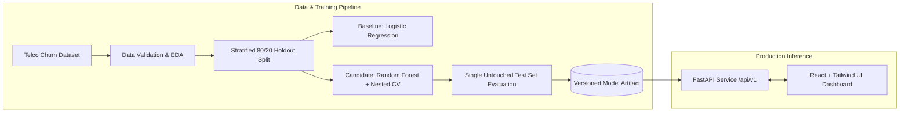

# Auto-Tuned Churn API

[](https://www.python.org/downloads/)
[](https://fastapi.tiangolo.com)
[](https://reactjs.org/)
[](https://opensource.org/licenses/MIT)

> **Advanced Data Science & Machine Learning Decision-Support System**  
> Hyperparameter Optimization with Random Search, Nested Cross-Validation, Production-style FastAPI Inference, and an Analyst React Dashboard.

---

## 📌 Problem Statement

Customer churn presents a significant threat to recurring revenue in telecom and subscription businesses. Retention teams frequently face:
- Massive customer bases with limited capacity for proactive outreach.
- Heuristic or ad-hoc scoring methods with high false-alarm rates.
- Unvalidated models that leak evaluation data or overstate real-world performance due to hyperparameter selection bias.

The **Auto-Tuned Churn API** delivers a reproducible, statistically validated customer-churn prediction and risk-tiering system designed strictly for **decision support**, providing transparency into confidence scores, operating thresholds, and model performance.

---

## 🔬 Scientific Grounding

This project directly implements principles from:

> **Bergstra, J., & Bengio, Y. (2012).**  
> *"Random Search for Hyper-Parameter Optimization."* Journal of Machine Learning Research (JMLR), 13, 281–305.

### Key Methodological Pillars:
1. **Efficiency of Random Search**: Random Search explores high-dimensional parameter spaces with significantly higher sample efficiency than Grid Search because different hyperparameter dimensions have unequal effective impacts on model generalization.
2. **Nested Cross-Validation (Nested CV)**:
   - **Inner CV**: Performs hyperparameter selection and tuning over randomized distributions.
   - **Outer CV**: Estimates the unbiased generalization performance of the tuning procedure itself.
3. **Strict Leakage Prevention**:
   - Reserving an untouched stratified holdout test partition prior to any exploration or transformation.
   - Encapsulating all preprocessing (scaling, imputation, one-hot encoding) strictly inside scikit-learn pipelines fit exclusively on training folds.
4. **Transparent Primary Metric**:
   - Optimizing primarily for **$F_1$-score** to handle target class imbalance (~26.5% churn rate), supported by Precision, Recall, Confusion Matrix, and PR-AUC.
   - Operating threshold selection justified based on business trade-offs (outreach capacity vs. churn capture rate).

---

## 🏛️ System Architecture



### High-Level Components:
- **`training/`**: Data ingestion, schema validation, EDA generators, feature engineering pipelines, nested CV orchestration, and experiment logging.
- **`backend/`**: High-performance, stateless FastAPI inference microservice with Pydantic request validation, CORS configuration, and comprehensive health monitoring.
- **`frontend/`**: Analyst-facing React dashboard featuring real-time single-customer scoring, threshold simulators, baseline vs. tuned metric visualizers, and interactive model cards.
- **`artifacts/`**: Versioned, self-contained deployment packages (fitted pipeline + decision threshold + feature schema metadata).

---

## 📂 Project Repository Structure

```text
Auto-Tuned-Churn-API/
├── docs/                     # Architecture, PRD, ADRs, and Model Card
│   ├── PRD.md
│   ├── model-card.md
│   ├── architecture.md
│   └── adr/
├── training/                 # Data science & training pipeline
│   ├── data/                 # Ingestion, validation, splitting
│   ├── eda/                  # Exploratory data analysis scripts
│   ├── features/             # Leakage-safe preprocessing pipelines
│   ├── models/               # Baseline, candidate models, random search, nested CV
│   ├── experiments/          # Structured experiment tracking & logging
│   └── configs/              # Hyperparameter distributions & CV settings
├── backend/                  # FastAPI inference microservice
│   ├── app/
│   │   ├── main.py           # Application entrypoint
│   │   ├── config.py         # App configuration & settings
│   │   ├── schemas.py        # Pydantic input/output schemas
│   │   ├── routes/           # /predict, /model, /experiments, /health
│   │   ├── services/         # Model loader & inference engine
│   │   └── middleware/       # Structured error handling & logging
│   └── tests/                # Unit, schema, and API integration tests
├── frontend/                 # React + Tailwind analyst dashboard
│   ├── src/
│   │   ├── components/       # KPI cards, scoring form, charts, model card
│   │   ├── services/         # API client integration
│   │   └── pages/            # Main dashboard views
│   └── tests/
├── data/                     # Raw & processed data placeholders
├── models/                   # Serialized model artifacts (.joblib)
├── tests/                    # End-to-end integration and data leakage tests
├── scripts/                  # Automation & training execution scripts
├── .github/workflows/        # CI/CD pipelines (lint, test, smoke test)
├── Dockerfile                # Multi-stage container definition
├── docker-compose.yml        # Multi-service container orchestration
├── requirements.txt          # Pinned Python dependencies
└── README.md                 # Project documentation (this file)
```

---

## 🚀 Quickstart & Setup (Upcoming Phases)

### 1. Prerequisites
- **Python**: 3.10 or higher
- **Node.js**: v18 or higher (for frontend dashboard)
- **Docker**: (Optional, for containerized run)

### 2. Environment Setup
```bash
# Clone the repository
git clone https://github.com/your-org/Auto-Tuned-Churn-API.git
cd Auto-Tuned-Churn-API

# Set up Python virtual environment
python -m venv .venv
source .venv/bin/activate  # On Windows: .venv\Scripts\activate
pip install -r requirements.txt
```

### 3. Pipeline Execution
```bash
# Step 1: Run data validation and EDA
python -m training.eda.distributions

# Step 2: Execute Nested CV & Random Search
python -m training.models.nested_cv

# Step 3: Train final model & export versioned artifact
python -m training.models.train_final
```

### 4. Running the Serving Stack
```bash
# Start FastAPI backend (port 8000)
uvicorn backend.app.main:app --reload --port 8000

# Start React analyst dashboard (port 3000)
cd frontend
npm install
npm run dev
```

---

## 🛡️ Responsible AI & Disclaimer

> [!IMPORTANT]
> **Educational & Decision-Support Prototype**:
> This system is designed solely as a **retention decision-support aid** to help customer success managers prioritize outreach. It is **not** an autonomous cancellation engine, credit assessment tool, or pricing mechanism. Churn predictions represent statistical propensities, not certainties, and should always be accompanied by human judgment.

---

## 📄 License
Distributed under the [MIT License](LICENSE).
